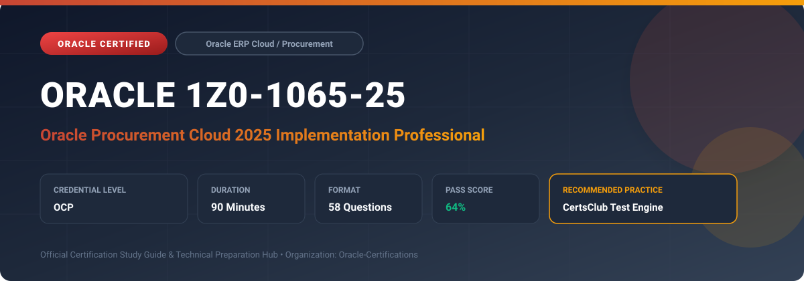

  

# Oracle 1Z0-1065-25: Oracle Procurement Cloud 2025 Implementation Professional

---

## 1. Exam Overview & Candidate Profile

The **Oracle 1Z0-1065-25: Oracle Procurement Cloud 2025 Implementation Professional** examination is designed for cloud professionals, enterprise architects, implementation consultants, and systems administrators who demonstrate deep practical knowledge and operational competence in deploying, configuring, and optimizing Oracle technologies.

The Oracle Procurement Cloud 2025 Implementation Professional (1Z0-1065-25) certification validates candidate expertise in implementing Oracle Fusion Procurement Cloud. Key focus areas include Procurement Business Unit setup, Purchasing configuration, Self-Service Procurement catalogs and smart forms, Supplier Qualification Management (SQM), Sourcing negotiations, and Procurement Contracts lifecycle.

### Target Audience & Prerequisites
- **Target Roles**: Implementation Consultants, Cloud Solution Architects, DevOps/SysOps Engineers, and Enterprise Functional Analysts.
- **Recommended Experience**: 1–2 years of hands-on experience in configuring, administering, or implementing the relevant Oracle solutions.
- **Credential Earned**: Oracle Certified Professional (OCP).

---

## 2. Key Exam Specifications

| Specification | Details |
| :--- | :--- |
| **Exam Code** | **Oracle 1Z0-1065-25** |
| **Official Title** | Oracle Procurement Cloud 2025 Implementation Professional |
| **Certification Track** | Oracle ERP Cloud / Procurement |
| **Exam Duration** | 90 Minutes |
| **Number of Questions** | 58 Questions |
| **Passing Score** | 64% |
| **Question Format** | Multiple Choice (Single/Multiple Answer), Scenario-Based Questions |
| **Delivery Provider** | Oracle University / Pearson VUE (Online Proctored or Test Center) |
| **Recommended Practice Engine** | [CertsClub Oracle Practice Tests](https://www.certsclub.com/oracle/1z0-1065-25-dumps.html) |

---

## 3. Official Blueprint & Exam Domain Breakdown

The examination assesses candidate competencies across core functional domains weighted as follows:

| Domain Area | Weighting |
| :--- | :--- |
| **Procurement Enterprise Architecture & BU Setup** | `15%` |
| **Purchasing & Purchase Order (PO) Processing** | `25%` |
| **Self-Service Procurement (Catalogs, Requisitions, Approvals)** | `20%` |
| **Supplier Management & Qualification (SQM)** | `15%` |
| **Sourcing Negotiations & Procurement Contracts** | `25%` |

---

## 4. Deep Dive into Complex & Challenging Technical Topics

To secure a passing score on the 1Z0-1065-25 exam, candidates must master the following advanced concepts:

- Configuring document types, change orders, automated PO generation from requisitions, and matching policies (2-way, 3-way, 4-way).
- Designing multi-tier approval hierarchies using BPM Worklist and Approvals and Notifications Management (AMX).
- Structuring punchout catalogs, internal catalog hierarchies, agreement lines, and smart forms in Self-Service Procurement.
- Implementing supplier qualification questionnaires, initiative scoring, and automated contract clause terms libraries.

---

## 5. Scenario-Based Demo & Practice Questions

### Question 1
When configuring invoice matching in Oracle Procurement Cloud, which matching type requires a valid purchase order line, receiving transaction, and inspection acceptance before an invoice can be paid?

A) 2-Way Matching
B) 3-Way Matching
C) 4-Way Matching
D) Receipt-Only Matching

- **Correct Answer**: `C) 4-Way Matching`
- **Technical Explanation**: 4-Way matching validates the Purchase Order, the Invoice, the Receipt transaction, and an explicit Inspection acceptance record before payment authorization.

---

### Question 2
In Self-Service Procurement, what mechanism allows employees to search an external supplier's web catalog directly from the requisition screen and transfer selected items back into their cart?

A) Supplier Qualification Questionnaire
B) Punchout Catalog via cXML or OAG protocol
C) Local Item Master Download
D) File-Based Data Import

- **Correct Answer**: `B) Punchout Catalog via cXML or OAG protocol`
- **Technical Explanation**: Punchout catalogs connect the Oracle Self-Service Procurement portal directly to external supplier e-commerce websites using standard protocols (cXML/OAG), returning cart items to the user's requisition.

---

## 6. Recommended Preparation Strategy & Practice Testing Engine

Achieving certification in **Oracle 1Z0-1065-25** requires balanced theoretical study and scenario-based simulation practice:

1. **Review Oracle Documentation**: Master architecture guides, implementation workbooks, and administration manuals on the Oracle Help Center.
2. **Hands-on Lab Practice**: Execute real-world configuration, policy setup, and troubleshooting tasks in your cloud tenancy or test instance.
3. **Simulated Exam Drills**: Practice answering timed, scenario-based multiple-choice questions to familiarize yourself with the question formats, traps, and timing constraints.

### Practice With CertsClub
For realistic practice questions, updated dumps, and mock testing environments:
- **Resource**: [CertsClub Oracle Practice Test Engine](https://www.certsclub.com/oracle/1z0-1065-25-dumps.html)
- **Special Discount**: Use coupon code **`club20`** during checkout for an instant **20% discount** on all practice exam bundles and testing engines.

---

## 7. Official Documentation & References

- [Oracle University Certification Registry](https://education.oracle.com/)
- [Oracle Help Center Documentation Portal](https://docs.oracle.com/)
- [Oracle Cloud Infrastructure & Applications Guides](https://docs.oracle.com/en/cloud/)
- [CertsClub Oracle Certification Exam Practice](https://www.certsclub.com/oracle/1z0-1065-25-dumps.html)

---

## 8. SEO & Discovery Keywords

`oracle 1z0-1065-25`, `oracle 1z0-1065-25 exam`, `oracle 1z0-1065-25 dumps`, `1Z0-1065-25 practice questions`, `1Z0-1065-25 study guide`, `oracle 1z0-1065-25 syllabus`, `oracle procurement cloud 2025 implementation professional`, `certsclub 1z0-1065-25`